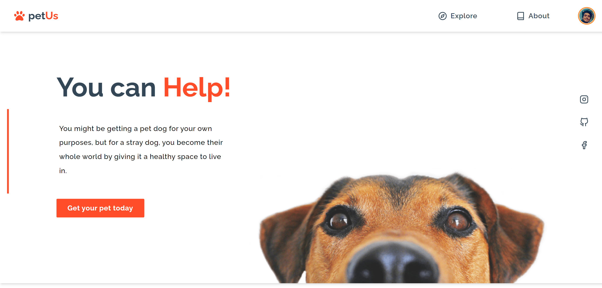
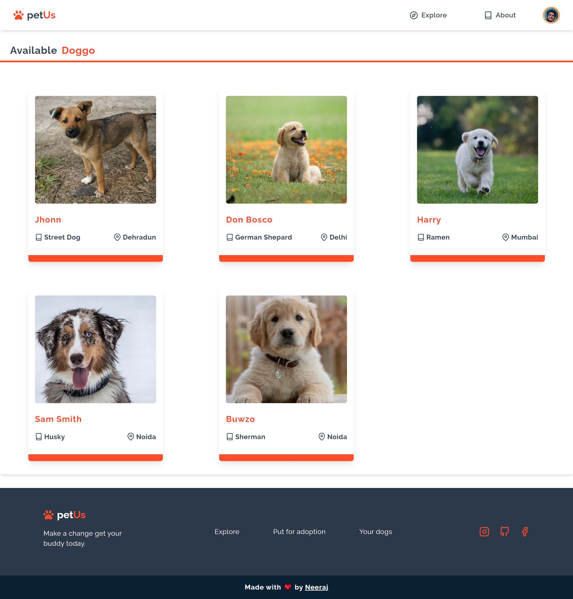

# petUs

### [PetUs](https://petus.vercel.app/) is a progressive web application, made for the adoption of dogs.

 

### It allows users to put dogs for adoption and also allows them to adopt them. It mainly focused on stray dogs who are looking for a home.

 

### Tech Stack : React, Redux, TailwindCSS, Firebase

 
 

## Home page

Landing page of the website.

 

## Explore page

You can find available dogs here for adoption. With their breed and location. For additional details you can click on the dog's card.

 

## Detail page

You can find dog specific details and contact details of the owner. And if you want to adopt a dog you can contact the owner.

 

## Put for adoption

After successful login you can also put a dog for adoption, by adding it details and a cute photo.

